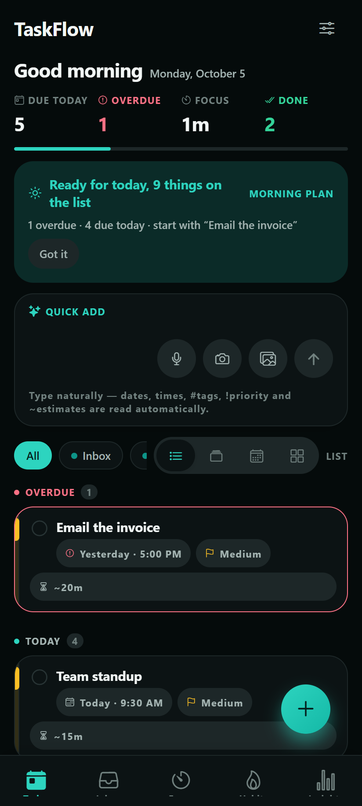
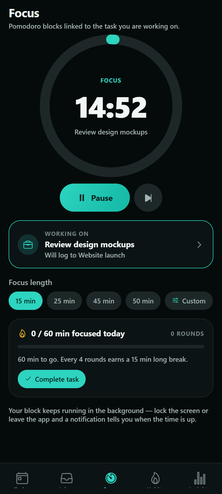
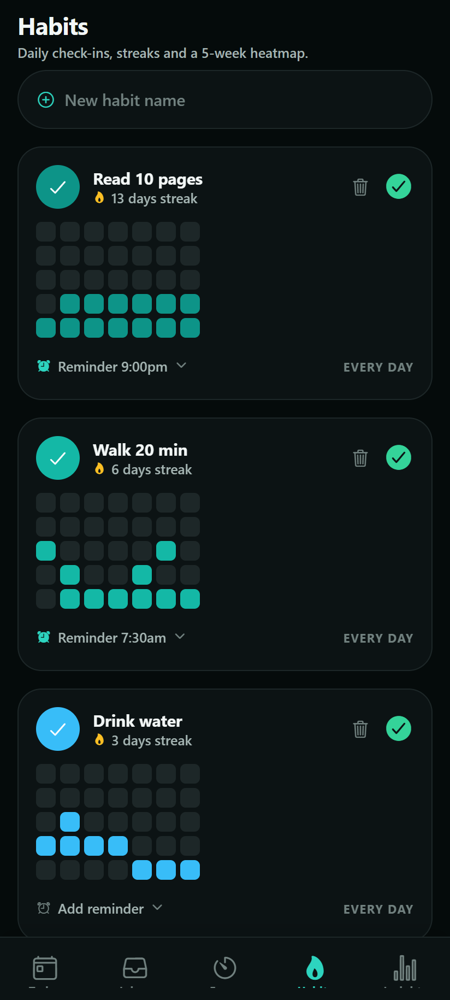
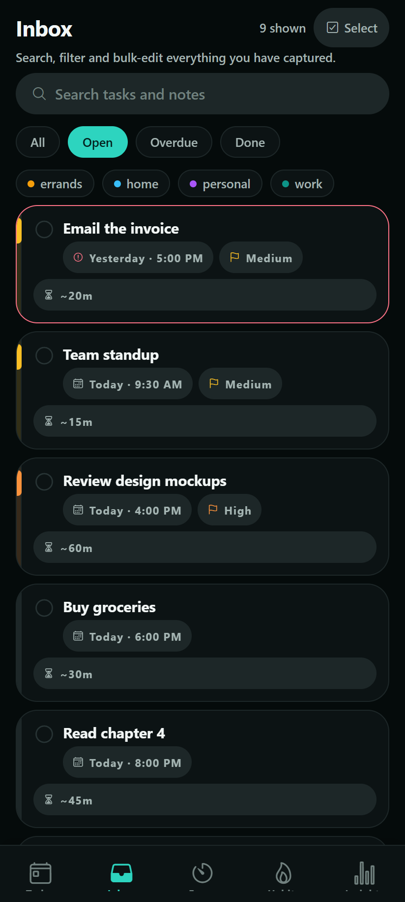
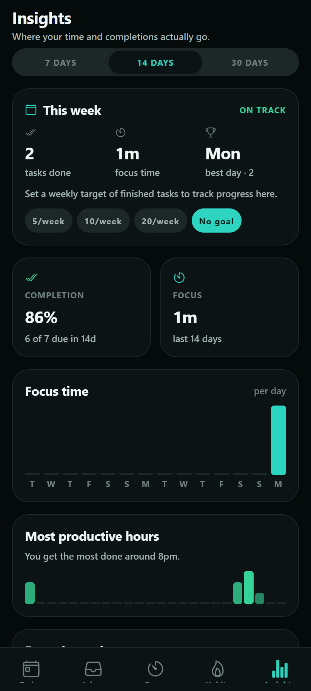
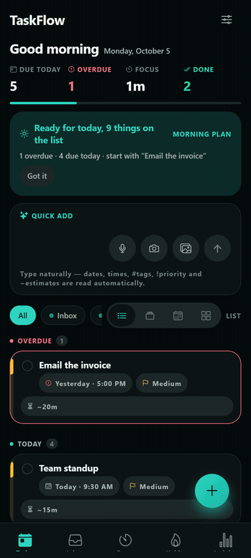

<div align="center">


<br />

[](https://github.com/Parth-191006/To-do/actions/workflows/ci.yml)
[](https://github.com/Parth-191006/To-do/releases/latest)
[](#verification)
[](https://expo.dev)
[](LICENSE)

**Capture a thought in one line, spend a focus block on it, keep the habit.**

An offline-first Android to-do app: natural-language capture, a Pomodoro focus
timer, habit streaks and analytics — under a teal-accented light/dark design,
with **no paywall and no telemetry**.

### → [Download TaskFlow-latest.apk](https://github.com/Parth-191006/To-do/releases/latest/download/TaskFlow-latest.apk)

</div>

---

## Screenshots

<table>
  <tr>
    <td align="center"><br /><sub>Today · quick add with parsed chips</sub></td>
    <td align="center"><br /><sub>Focus · ring + in-circle wheels</sub></td>
    <td align="center"><br /><sub>Habits · streaks + heatmap</sub></td>
  </tr>
  <tr>
    <td align="center"><br /><sub>Inbox · search + bulk select</sub></td>
    <td align="center"><br /><sub>Insights · where the time goes</sub></td>
    <td align="center"><br /><sub>Quick tour</sub></td>
  </tr>
</table>

---

## Why TaskFlow

**Offline-first, not cloud-first.** SQLite on the device is the source of truth.
Every screen reads locally, so the app opens instantly and works in airplane
mode. The cloud is an optional replication target; nothing on the read path
waits for a network.

**No paywall, no tiers, no feature gating.** There is no subscription code in
the project. Every feature — AI breakdown, geofenced reminders, analytics,
collaboration — ships unlocked.

**Capture that respects how you actually think.** Type
`Submit report tomorrow 5pm #Work !high ~45m` and the date, time, tag, priority
and estimate are recognised and shown as chips *while you type*. No date
pickers, no forms.

**Focus and habits in the same place as the work.** A Pomodoro timer bound to
the task you are on, short and long break cycles, habit streaks with a
heatmap — not three separate subscriptions.

**Honest about its AI.** The default planner runs on device. The remote model is
an upgrade you can point at your own endpoint, and the button works either way.

---

## Features

**Capture**
- Natural-language input: `Submit report tomorrow 5pm #Work !high ~45m` becomes a
  fully structured task, with inline chips as you type — relative and absolute
  dates, weekday and recurrence (`every monday`, `daily`), `#tags`, `@projects`,
  `!priority` / `p1`–`p4` and `~estimates`.
- Voice notes (record and play back inline) with optional transcription, plus
  photo attachments and an inline camera action.
- **Break down with AI** creates 3–5 subtasks, each with an estimate and a
  priority. The on-device planner is the default and the fallback, so the button
  never needs the network.
- Templates and **repeat last task** for the things you add every day.

**Organisation**
- Subtasks (arbitrarily nested), lists/projects with colour, tags, and an inbox.
- Four views over the same data: **List**, **Kanban**, **Calendar agenda**,
  **Eisenhower matrix** — edit in one and it persists everywhere.
- Today sorted into **Overdue → Today → Upcoming → Anytime → Completed**, with
  live counters for due-today, overdue, focus minutes and done.
- Search across titles and notes using SQLite **FTS5** (prefix matching, ranked),
  plus tag filters.
- Inbox: swipe actions, bulk select (move / tag / complete / delete), and a
  **Go to Today** shortcut that only appears when the list is truly empty.

**Notifications**
- Time reminders and recurrence (daily / weekly / monthly / yearly).
- Actionable banners: **Complete**, **Snooze 5m / 1h / Tomorrow**, **Open** —
  and **start a focus block** on the task, straight from the notification.
- Geofenced alerts ("remind me when I reach the office"), re-armed whenever a
  reminder changes.
- Four Android channels (reminders, urgent with DND bypass, focus, habits) and
  iOS time-sensitive interruption levels for urgent tasks.
- Every permission is requested **on first use, after a short explanation** —
  background location when the first geofence is created, exact alarms when the
  first exact reminder is scheduled, the DND bypass only for urgent tasks.
  Denial degrades the feature quietly instead of breaking it.

**Focus**
- Large circular countdown ring showing the time left. The 15/25/45/50 chips
  stay one tap away; **Custom** opens the hour/minute/second wheel picker.
- **Working on** is a real picker: a searchable bottom sheet over your tasks.
  Starting with nothing attached is allowed and gets a gentle prompt.
- Short and long break cycles (long break every 3/4/5 blocks, or off), a round
  counter for the session, and a daily-goal progress bar.
- Background accuracy — the clock re-derives from the wall clock, so a
  backgrounded timer does not drift — plus an end-of-block notification and
  attribution of the minutes to the task and project.

**Habits**
- One-tap starter suggestions (Drink water, Read 10 pages, Walk 20 min…).
- Streak flame, today's check button and undo, longest streak, and a 5-week
  heatmap.
- Optional reminder time and weekly target days (S M T W T F S / every day).

**Insights**
- Completion rate, focus minutes per day, most productive hours, focus by
  project — over 7 / 14 / 30-day windows.
- Weekly summary card (tasks done, focus hours, best day, current streaks) and
  an optional weekly goal.
- Empty states explain what unlocks each chart, with a faded sample labelled
  *Example* — no mystery blanks.

**Reviews, data and security**
- Morning "plan your day" and evening wrap-up reviews.
- Export to **JSON** and **CSV**, import from pasted JSON, an automatic local
  backup before anything destructive, and restore from either.
- Optional **biometric app lock**, engaged 30 s after the app goes to
  the background.

**Collaboration & sync** *(optional — set two env vars)*
- Invite a collaborator by email, see list members, read an activity log.
- Offline-first sync: pending-row push, delta pull, realtime updates on open
  lists, and **per-field merge** — two people editing different fields of the
  same task both keep their change.

**Design**
- Light / dark / follow-system themes, teal accent, haptics, spring motion, and
  a palette driven entirely from `src/theme/tokens.ts`.
- WCAG AA contrast in both themes, TalkBack labels on icon buttons, 48 dp
  targets, safe-area insets and font scaling respected.
- Skeleton loaders while data is still coming in.
- The mascot mark and every launcher asset are rendered from one generator,
  `scripts/generate-logo.py`.

### AI, explicitly

| | |
| --- | --- |
| **Default** | Everything runs on device. The subtask planner is a keyword-matched template library — no request is ever made, so **the feature works in airplane mode**. |
| **With `EXPO_PUBLIC_AI_ENDPOINT`** | The title, notes, estimate and priority of that one task are POSTed to the endpoint you configure, with a 3.5 s budget. Any failure — offline, 401, 429, timeout — falls straight back to the on-device planner. |
| **Keys** | No paid or secret key ships in `EXPO_PUBLIC_*`. Those values are compiled into the APK and are readable by anyone who unpacks it. The sample proxy in [`supabase/functions/ai-breakdown/`](supabase/functions/) holds the key behind Supabase `verify_jwt`, per-user resolution and a per-minute rate limit — see [`supabase/functions/README.md`](supabase/functions/README.md). |

---

## What is stored where

**On the device, always:** tasks, notes, subtasks, lists, tags, habits and
their logs, focus sessions, voice notes, photo attachments, preferences. One
SQLite file. **No telemetry, no analytics SDK, no crash reporter.**

**Synced, only if you configure Supabase and sign in:** task, project, tag,
habit and focus-session rows, plus the collaboration activity log. Attachment
*bytes* never leave the device — only their local URIs replicate.

**Sent to AI, only if you configure an endpoint:** the single task you asked to
break down. Nothing else, and nothing at all by default.

**Leaves when you choose:** JSON/CSV export through the system share sheet, and
the automatic local backup. Settings → Data states this in the product.

---

## Tech stack

| Layer | Choice | Why |
| --- | --- | --- |
| Framework | [Expo SDK 57](https://expo.dev) · React Native 0.86 · React 19 | Managed workflow, OTA-friendly, native modules where they matter |
| Navigation | [expo-router](https://docs.expo.dev/router/introduction/) | File-based routes under [`app/`](app) |
| Storage | [expo-sqlite](https://docs.expo.dev/versions/latest/sdk/sqlite/) (WAL) + FTS5 | Instant, offline-first, full-text search |
| State | [Zustand](https://github.com/pmndrs/zustand) | One store, selector-driven renders, no boilerplate |
| Backend (optional) | [Supabase](https://supabase.com) (Postgres, Auth, Realtime, RLS, Edge Functions) | Zero-config local mode; sync switches on with two env vars |
| Notifications | expo-notifications + expo-task-manager + expo-location | Scheduling, actionable categories, background geofencing |
| NLP | Hand-rolled parser (no deps) | Deterministic, unit-tested, sub-millisecond on device |
| Tests | [Vitest](https://vitest.dev) | Same runner for logic, schema and the FTS round-trip |

---

## Screenshots strip

Every image is a real dark- or light-theme render of the app, captured at
412×915 @2x. The table above uses five of them plus the tour GIF
([`docs/demo.gif`](docs/demo.gif), six frames, one per feature area).

The rest live in [`docs/screenshots/`](docs/screenshots):

| File | Shows |
| --- | --- |
| [`today.png`](docs/screenshots/today.png) · [`today-light.png`](docs/screenshots/today-light.png) | Today, with the mascot empty state in dark and light theme |
| [`quick-add.png`](docs/screenshots/quick-add.png) | Chips appearing under the input as `Submit report tomorrow 5pm #Work !high ~45m` is typed |
| [`focus.png`](docs/screenshots/focus.png) · [`focus-custom.png`](docs/screenshots/focus-custom.png) | The countdown ring on a task, and the wheel picker open inside it |
| [`focus-banked.png`](docs/screenshots/focus-banked.png) | A finished block banked against the task and its project |
| [`board.png`](docs/screenshots/board.png) | Kanban view over the same data as the list |
| [`habits.png`](docs/screenshots/habits.png) | Streak flame, today's check and the 5-week heatmap |
| [`inbox.png`](docs/screenshots/inbox.png) | Search, filters and bulk-select mode |
| [`insights.png`](docs/screenshots/insights.png) · [`insights-light.png`](docs/screenshots/insights-light.png) | Weekly summary, completion rate and focus charts in both themes |

---

## Quick start

```bash
npm install
npx expo start          # press i (iOS), a (Android) or scan the QR code
```

The app uses native modules for notifications, geofencing, audio and SQLite, so
run it in a **development build** for full functionality:

```bash
npx expo run:android    # or: npx expo run:ios
```

Expo Go renders the UI, but local notifications, geofencing and background
tasks are restricted there.

There is also a **web preview** — `npm run web` bundles the same screens through
`react-native-web` (SQLite runs on `wa-sqlite` in the browser, so full-text
search and native-only features are absent). It is a fast way to look at the UI;
Android is the shipping target.

## Scripts

| Command | What it does |
| --- | --- |
| `npm start` | Start the Expo dev server |
| `npm run ios` / `npm run android` / `npm run web` | Start on a specific platform |
| `npm run typecheck` | `tsc --noEmit` over the app **and** the tests |
| `npm run test` | Run every Vitest suite once |
| `npm run test:watch` | Vitest in watch mode |
| `npm run verify` | `typecheck` + `test` — run this before tagging a build |
| `npm run verify:brand` | 13 assertions on the generated logo assets (needs Python + Pillow) |
| `python3 scripts/generate-logo.py` | Regenerate icon, adaptive layers, splash, favicon and banner |

## Verification

```bash
npm run verify                      # tsc --noEmit + 115 assertions, all green
npm run verify:brand                # 13 checks that the brand assets are correct
npx expo-doctor                     # dependency & config checks
npx expo export --platform android  # bundling smoke test
```

The suites import the shipping modules through the same `@/…` alias the app
uses:

- **NLP** — date/time/tag/priority/estimate/recurrence extraction, relative and
  absolute dates, token spans, the 30-minute reminder lead, empty and
  punctuation-only input.
- **Focus clock** — pause keeps remaining time, backgrounding re-derives from
  the wall clock, skip banks the partial block.
- **Habits** — streak runs, missed days, and the check-in/undo regression.
- **Formatting** — the hour/minute/second thresholds behind the insight tiles
  (seconds, minutes, the “just under an hour” guard, and multi-hour values).
- **Schema** — connection pragmas stay outside the migration transaction (the
  bug that once broke every fresh install), migration list integrity, all 14
  tables, idempotent inbox seed, FTS index sync, and the v2/v3 columns.
- **Geofence** — the re-arm signature gate: unchanged fence sets never touch
  the OS, denied permissions stay retryable, and completing a fenced task drops
  its region.
- **Sync merge** — the per-field conflict rule, including the two-people,
  different-fields case the old whole-row merge lost.
- **FTS** — every query the builder produces is run against a **real FTS5
  index**, because a syntax error only exists at `MATCH` time.

CI ([`ci.yml`](.github/workflows/ci.yml)) runs typecheck, tests and the brand
check on every push and pull request. The APK pipeline
([`android-apk.yml`](.github/workflows/android-apk.yml)) runs on `v*` tags.

## Environment (all optional)

The app is fully functional with **zero configuration** — SQLite is the source
of truth and every cloud feature degrades to a no-op.

| Variable | Enables |
| --- | --- |
| `EXPO_PUBLIC_SUPABASE_URL` | Cloud sync, auth, real-time shared lists |
| `EXPO_PUBLIC_SUPABASE_ANON_KEY` | (pairs with the URL above) |
| `EXPO_PUBLIC_AI_ENDPOINT` | Remote AI subtask breakdown (falls back to the on-device planner) |
| `EXPO_PUBLIC_TRANSCRIBE_ENDPOINT` | Voice-to-text (falls back to keeping the audio note attached) |

The anon key is public by design and protected by row-level security. **Never
put a model API key in an `EXPO_PUBLIC_*` variable** — those values are
compiled into the bundle. Keep model keys in the edge function.

Create a `.env` (or `app.json` → `expo.extra`) with any of the above. For the
backend, run the migrations in [`supabase/migrations/`](supabase/migrations/)
in order — they create every table, the row-level security policies, the
per-field merge column and the AI rate limiter.

---

## Architecture

```
app/                      expo-router routes (file-based navigation)
  (tabs)/                 Today · Inbox · Focus · Habits · Insights
  task/[id].tsx           Task detail: subtasks, attachments, editor
  project/[id].tsx        List detail: sharing, invite, activity
  settings.tsx            Appearance, notifications, sync, data, security
src/
  domain/                 Shared types + pure habit maths
  db/                     SQLite client, migrations, FTS, repositories
  nlp/parser.ts           Natural-language task parser (pure, no deps)
  services/
    notifications/        Scheduling, categories, actions, geofencing
    ai/                   Subtask breakdown + speech-to-text
    data/                 Export, import, local backup
    sync/                 Offline-first push/pull + per-field merge
    supabase/             Optional backend client (auth included)
  store/                  Zustand store + pure selectors
  components/             UI primitives, sheets, views (kanban/agenda/matrix)
  theme/                  Design tokens + light/dark provider
tests/                    Vitest suites (parser, clock, habits, schema,
                          geofence, sync merge, FTS, formatting)
supabase/
  migrations/             Postgres schema, RLS, field_meta, AI rate limiter
  functions/              Sample authenticated AI proxy
scripts/                  Brand generator + brand verifier (Python)
.github/workflows/        CI on push/PR, build/sign/release on tags
```

See **[ARCHITECTURE.md](./ARCHITECTURE.md)** for the data schema, notification
engine, sync strategy and the reasoning behind each choice. The feature-by-feature
audit that drove this release is in **[docs/AUDIT.md](docs/AUDIT.md)**.

---

## Building & releasing

Release APKs are built entirely by GitHub Actions — no local Android SDK
required. Every run of [`android-apk.yml`](.github/workflows/android-apk.yml):

1. restores (or creates) the release keystore from a cached artifact,
2. runs `npm run verify`, `npx expo prebuild` and assembles a **signed
   arm64-v8a** release,
3. verifies the signature and uploads `TaskFlow-apk-<run>` as a run artifact,
4. on a version tag, publishes a GitHub release with
   **`TaskFlow-latest.apk`** (stable permalink) and
   **`TaskFlow-v<version>-arm64-v8a.apk`**.

Because the keystore persists between runs, release APKs share one signature:
updates install over existing installs without losing local data.

### Install in 30 seconds

1. Copy the `.apk` to your phone (download directly, or email/Drive/USB).
2. Tap it in **Files → Downloads**.
3. Allow **Install unknown apps** for that source when prompted (the normal
   sideloading dialog — the APK isn't from the Play Store).
4. Open **TaskFlow**, grant the notification permission. Done.

Troubleshooting and older-build caveats: **[docs/INSTALL.md](docs/INSTALL.md)**.

---

## Roadmap

- [x] Teal rebrand with a generated mascot mark and one-source brand assets
- [x] Audit every advertised feature and fix what was broken
- [x] Countdown ring with the wheel picker behind a **Custom** chip
- [x] Habit reminders, starter chips and weekly target days
- [x] Daily and evening reviews, templates, repeat-last-task
- [x] JSON/CSV export, import and automatic local backup
- [x] Biometric app lock
- [x] Notification quick action to start a focus block
- [x] Per-field sync merge instead of whole-row last-write-wins
- [x] Vitest suites and a CI workflow on every push
- [ ] Android home-screen widget (today's tasks + quick add)
- [ ] Optional Google Drive backup target
- [ ] Background periodic sync (`expo-background-task`)
- [ ] Manual resolution UI for the rare remaining sync conflict
- [ ] Attachment upload to Supabase Storage
- [ ] iOS distribution (TestFlight via `eas build`)

## Known limitations

- **Sync conflicts are merged, not negotiated.** Each field keeps the newer
  write; a field nobody stamped falls back to the row's `updated_at`. Rows last
  written before schema v3 therefore behave like whole-row last-write-wins until
  they are edited again, and there is no UI for reviewing an unusual merge.
- **iOS cannot be sideloaded the way Android can.** Apple requires a signed IPA
  through TestFlight or a registered device. Run from source with
  `npx expo run:ios`, preview in Expo Go, or use
  [`eas build`](https://docs.expo.dev/build/introduction/) with the included
  [`eas.json`](eas.json).
- **Some behaviour can only be proven on hardware** — notification sound and
  DND bypass, geofence wake-ups after a cold start, background timer accuracy
  and biometric prompts. Those are verified by inspection, and each is listed as
  such in [docs/AUDIT.md](docs/AUDIT.md).
- **`npm run lint` is not wired up.** The repo has no ESLint config, so
  typechecking plus the test suite are the static checks.
- **No widget or cloud drive backup yet** — both are on the roadmap above.

## FAQ

**Does it work offline?**
Completely. Local SQLite is the source of truth; sync, AI and transcription are
optional layers on top.

**Is there a paywall or an account requirement?**
No. Every feature is unlocked, and no account is needed to use the app.

**Does "Break down with AI" need the internet?**
No. The on-device planner is the default and the fallback. If you configure an
endpoint, the remote model is tried first with a 3.5 s budget and any failure
falls back locally.

**Where is my data?**
On your device, in one SQLite file. It is only sent to a backend if you
configure Supabase yourself and sign in. There is no telemetry.

**How do I back up?**
Settings → Data exports JSON or CSV, writes an automatic local backup before
anything destructive, and can restore from either.

**Why can't Google Play see this app?**
It is distributed as a signed APK from GitHub Releases — sideload it as
described above.

**Notifications or geofences aren't firing.**
Check that permission was granted (Settings → Apps → TaskFlow) and that battery
optimisation is not restricting the app. Every permission is requested with an
explanation the first time a feature needs it.

**Can I contribute?**
Yes — see [CONTRIBUTING.md](CONTRIBUTING.md).

---

## Platform notes

- **Android** creates four notification channels (`reminders`, `urgent`,
  `focus`, `habits`); the urgent channel requests `bypassDnd`. Exact-alarm and
  background-location permissions are declared in [`app.json`](app.json) and
  requested at runtime only when the matching feature is first used.
- **iOS** uses `interruptionLevel: 'timeSensitive'` for urgent tasks;
  `'critical'` alerts require a special Apple entitlement and are not used.
- Haptics and location features are silently skipped on platforms or devices
  that do not support them — they are flourishes, never blockers.

## Contributing

Issues and pull requests are welcome — see **[CONTRIBUTING.md](CONTRIBUTING.md)**
for setup, the test suites and the conventions. In short:

```bash
npm run verify        # typecheck + every suite
```

Keep changes token-driven (no hardcoded colours outside `src/theme/tokens.ts`
and the documented notification accents), and add a test for any pure logic you
touch.

## License

Released under the [MIT License](LICENSE).

Built with [Expo](https://expo.dev), [React Native](https://reactnative.dev),
[SQLite](https://www.sqlite.org) and [Supabase](https://supabase.com).
